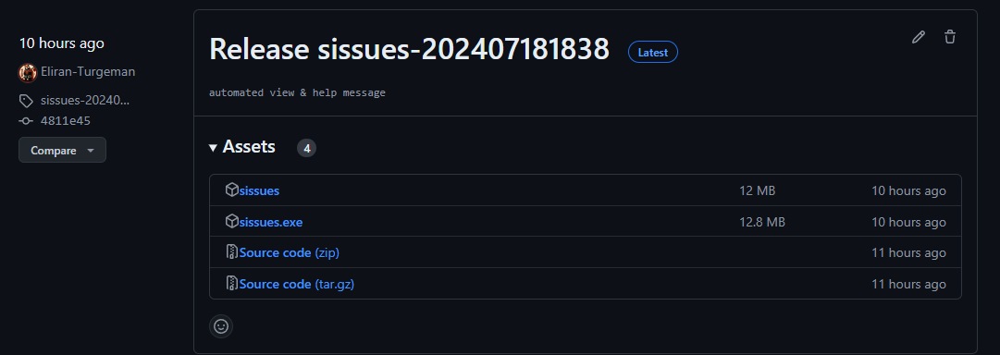
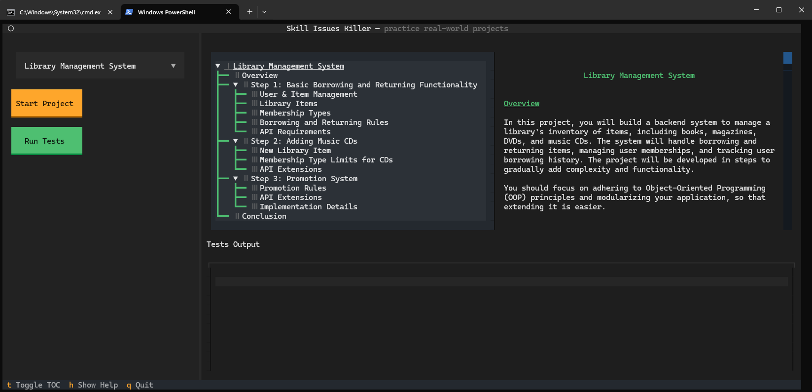

# Skill Issues Killer Projects Plaform

Welcome to our projects platform! This platform is designed to help you build and test API projects through a series of guided exercises. This README will guide you through the installation process and provide links to additional guides to help you get started.

## Installation

To get started, you need to install the platform on your machine. Follow these steps:

1. **Go to the Repository Releases on GitHub**: Navigate to the [releases page](https://github.com/sissues/cli/releases) on our GitHub repository.
2. **Download the Correct Asset**: Find the latest release and download the asset appropriate for your operating system. Here's a picture to help you locate the releases:

**_For Mac / Linux_** - Download the first asset named `sissues`.

**_For Windows_** - Download the second asset named `sissues.exe`

3. **Run the platform**: Click on the downloaded asset, and it should open up the following CLI

## Getting Started

Once you have installed the platform, you can start working on your API projects. Here are some guides to help you get started:
1. [Getting Started with Your API Project](https://github.com/sissues/cli/blob/main/docs/getting_started.md)
2. [Getting Started with Docker for API Projects](https://github.com/sissues/cli/blob/main/docs/getting_started_with_docker.md)

## Additional Resources

- **Community Support**: If you have any questions or need help, don't hesitate to reach out to by [opening an issue](https://github.com/sissues/cli/issues).
- **Documentation**: Refer to the platform's documentation for detailed information on features and usage.

## Final Tips

- **Stay Positive**: Learning new skills can be challenging, but stay positive and persistent. You can do this!
- **Practice Makes Perfect**: The more you practice, the better you'll become. Keep working on the exercises and refining your skills.
- **Use Resources**: Make use of the resources available to you, including documentation, forums, and community support.

We’re excited to see what you create with our platform. Happy coding!
